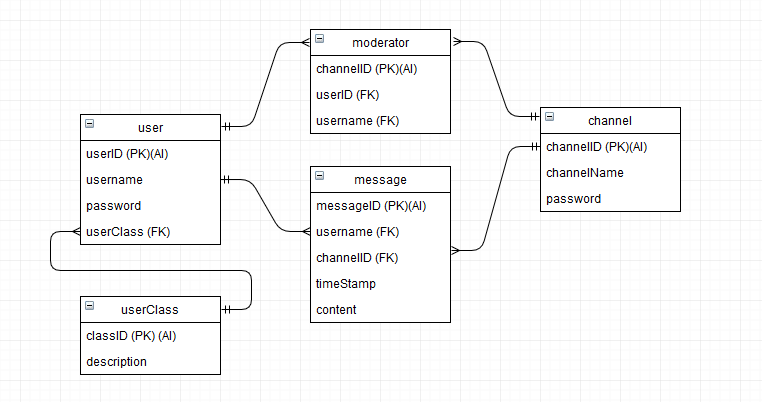
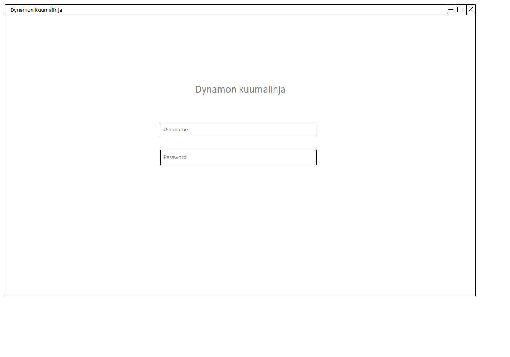
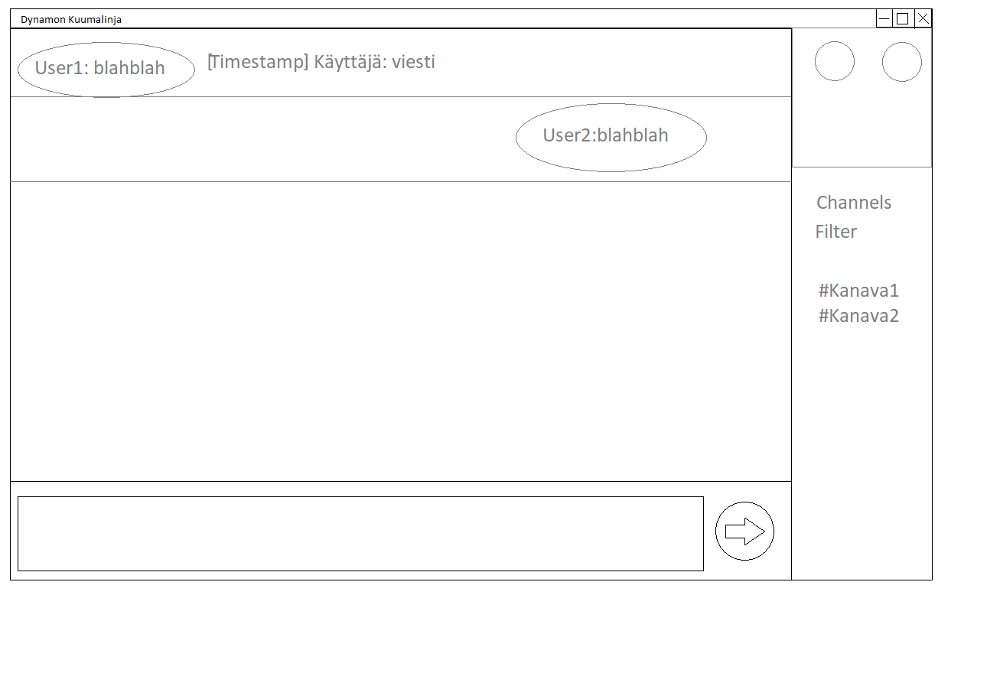

# Dynamon kuumalinja

## Tekijät

* Samuli Virtapohja - L4721
* Mikko Martikainen - K8936

## Sovelluksen kuvaus

Dynamon kuumalinja on irc labranet ympäristössä. Sovellus hakee tiedot labranetin mysql-palvelimelta, joten käyttäjän tulee olla labranettiin yhteydessä, jotta sovellus toimii.

### Käyttöympäristö

* Labranet
* Windows
* Verkkoyhteys

### Käytetyt teknologiat

* C#, .Net
* WPF
* Mysql

* Microsoft Visual Studio 2017
* Mysql Workbench
* draw.io

## Toteutettavat toiminnot

- Käyttäjä pystyy rekisteröitymään palveluun
- Käyttäjä pystyy luomaan "huoneita"
- Käyttäjä pystyy moderoimaan omia huoneitaan
- Käyttäjä pystyy lähettämään ja lukemaan viestejä huoneissa, joihin hänellä on salasana

## Käsitemalli

## Mockup

## Työnjako

Mikko:
- Tietokannat

Samuli:
- Layout

Yhdessä:
- Suunnittelu
- Toteutus

## Työaikasuunnitelma