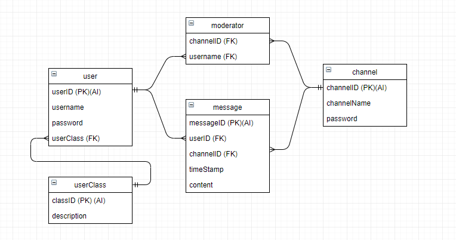
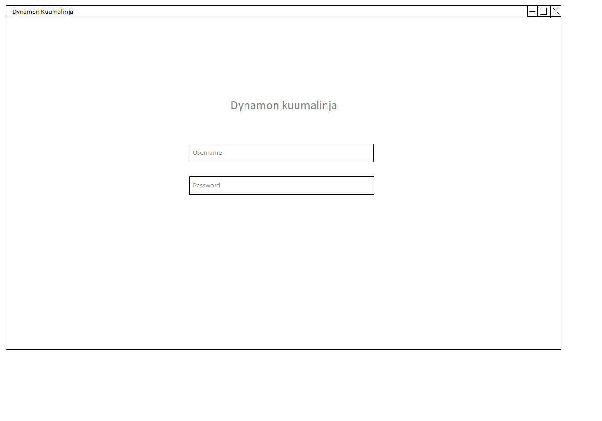
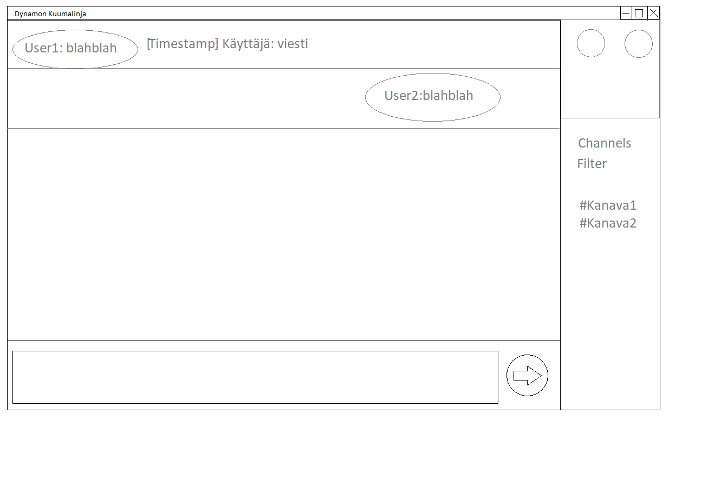

# Dynamon kuumalinja

## Tekijät

* Samuli Virtapohja - L4721
* Mikko Martikainen - K8936

## Sovelluksen kuvaus

Dynamon kuumalinja on irc labranet ympäristössä. Sovellus hakee tiedot labranetin mysql-palvelimelta, joten käyttäjän tulee olla labranettiin yhteydessä, jotta sovellus toimii.

### Käyttöympäristö

* Labranet
* Windows
* Verkkoyhteys

### Käytetyt teknologiat

* C#, .Net
* WPF
* Mysql

* Microsoft Visual Studio 2017
* Mysql Workbench
* draw.io

## Toteutettavat toiminnot

### Prioriteetti 1

* Viestin lähetys
* Viestien lukeminen
* Huoneiden valinta
* Huoneiden luonti
* Huoneiden filtteröinti
* Sisäänkirjautuminen

### Prioriteetti 2

* Huoneiden salasanan vaihtaminen
* käyttäjän poistaminen kanavalta
* huoneiden poisto

## Käsitemalli

## Mockup

## Työnjako

Mikko:
- Tietokannat

Samuli:
- Layout

Yhdessä:
- Suunnittelu
- Toteutus

## Työaikasuunnitelma

- Viikko 1 Suunnittelu, hahmotus (tietokannan rakenne)
- Viikko 2 Prototyypin teko (Mockupien perusteella), hakujen luonti hahmotus
- Viikko 3 Koodin teko
- Viikko 4 Koodin hionta (viimeisten ominaisuuksien luonti)

## TO-DO

- encryptaus salasanoille (md5 tietokannoissa, mutta ei ole turvallinen)
- tietokanta palvelimen muunto app.config tiedostoon ja sen encryptaus // jos tehdään

## Done

- suunnittelu
- tietokannan salasanan muunto app.config tiedostoon ja sen encryptaus
- sql lauseiden muuttujien muuntaminen parametreiksi (sql- injektioiden estoa)
- Kanavien salasanojen prompti
- dialogiboxi väärillä tunnuksilla tapahtuvalle kirjautumisyritykselle
- Chat ikkuna
- Viestinlähetyksen piilotus/paljastus, kun käyttäjä kirjautuu sisään kanavalle/vaihtaa kanavaa
- Kanavien salasanojen promptin ulkonäkö
- Registerin teko (integroidaanko loginiin, jos ei ole tunnuksia niin luodaan, vaatii pientä mietintää)
- Sovelluksen ulkonäkö
- uloskirjautuminen
- kanavien ja viestien automaattinen päivitys
- refresh -painike
- ER-kaavio
- Testidata
- C# mysql referenssit